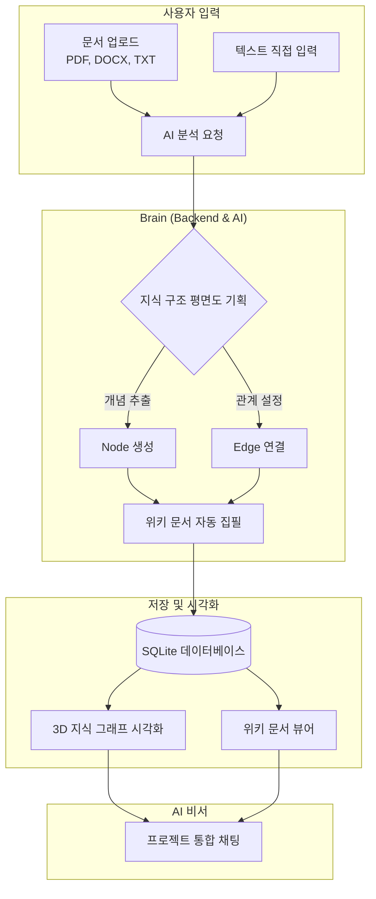

# 📚 AutoWiki AI: 지휘자처럼 다루는 AI 지식 네트워크


> **"복잡한 문서와 파편화된 정보를 한눈에 들어오는 지식의 지도로 변환하세요."**

AutoWiki는 단순히 글을 요약하는 도구가 아닙니다. 방대한 문서와 데이터 속에서 핵심 개념(Node)을 추출하고, 그들 사이의 숨겨진 관계(Edge)를 찾아내어 인터랙티브한 **3D 지식 그래프**와 **위키백과 스타일의 문서**로 자동 구성해주는 지능형 지식 관리 플랫폼입니다.

---

## ✨ 주요 기능 (Key Features)

### 1. 🔍 AI 자동 지식 추출 (Smart Extraction)
PDF, Word, TXT 파일을 업로드하기만 하세요. AI가 텍스트를 정밀 분석하여 새로운 위키 항목을 제안하고, 기존 문서에 보완할 내용을 스스로 판단합니다.

### 2. 🕸️ 3D 인터랙티브 지식 그래프 (3D Visualization)
지식은 평면이 아닙니다. 복잡하게 얽힌 정보의 관계를 3D 공간에서 자유롭게 탐색하세요. 
- **루트 노드 강조**: 프로젝트의 핵심 주제를 한눈에 파악.
- **외딴섬(Island) 감지**: 메인 흐름과 단절된 지식을 찾아내어 연결 고리를 제시.

### 3. ✍️ 섹션 단위 정밀 편집 (Precision Patching)
문서 전체를 새로 고칠 필요가 없습니다. AI는 부족한 부분이나 최신 정보가 필요한 특정 섹션만 정밀하게 타격하여 업데이트합니다.

### 4. 💬 프로젝트 특화 AI 채팅 (Context-Aware Chat)
구축된 지식 세계관을 완벽히 이해하고 있는 AI 비서와 대화하세요. "이 인물과 저 사건은 어떤 관계인가요?"와 같은 질문에 지식 그래프를 기반으로 정확히 답변합니다.

### 5. 🛠️ GitHub Copilot 기반의 강력한 모델링
최신 GPT-4o, Gemini 1.5 Pro 등 최고의 성능을 자랑하는 AI 모델들을 GitHub Copilot 연동을 통해 손쉽게 활용할 수 있습니다.

---

## 🏗️ 서비스 아키텍처 (Architecture)

비전공자분들도 쉽게 이해할 수 있도록 AutoWiki의 작동 원리를 그림으로 표현했습니다.



---

## 🛠️ 기술 스택 (Tech Stack)

| 구분 | 기술 | 설명 |
| :--- | :--- | :--- |
| **Frontend** | **Next.js 15 (App Router)** | 빠르고 현대적인 웹 인터페이스 제공 |
| **Styling** | **TailwindCSS** | 유려하고 세련된 프리미엄 디자인 |
| **Backend** | **FastAPI (Python)** | 고성능 비동기 API 서버 |
| **AI Framework** | **LangChain** | AI 모델의 체계적인 오케스트레이션 |
| **Database** | **SQLite (SQLAlchemy)** | 가볍고 견고한 로컬 데이터 저장소 |
| **Visualization** | **Three.js / Force Graph** | 몰입감 넘치는 3D 지식 구조 시각화 |

---

## 🚀 시작하기 (Quick Start)

### 1. 백엔드 설정
```bash
cd backend
python -m venv venv
source venv/bin/activate  # Windows: venv\Scripts\activate
pip install -r requirements.txt
python main.py
```

### 2. 프론트엔드 설정
```bash
cd frontend
npm install
npm run dev
```

### 3. 접속
브라우저에서 `http://localhost:3000`에 접속하여 화려한 지식 구축의 세계를 경험하세요!

---

## 🔒 보안 및 개인정보 (Security)
- 모든 GitHub 토큰은 AES-256 방식으로 **암호화되어 저장**됩니다.
- CSRF 보호 및 HTTPS 대응을 통해 사용자의 데이터를 안전하게 보호합니다.

---

## 📄 라이선스 (License)
이 프로젝트는 MIT License를 따릅니다. 상세 내용은 [LICENSE](LICENSE) 파일을 확인하세요.

---

<p align="center">
  <b>AutoWiki</b>와 함께라면, 여러분의 지식은 더 이상 파편화되지 않습니다.<br/>
  지금 바로 당신만의 지식 지도를 그려보세요.
</p>
